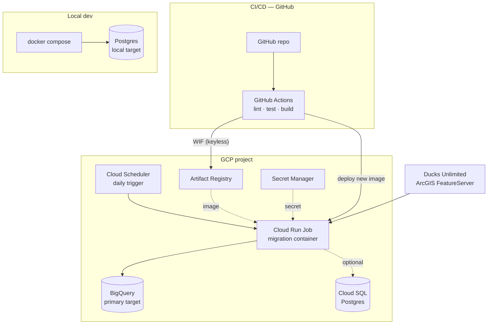

# Ducks Unlimited — Migration Pipeline

A production-oriented data **migration** pipeline that extracts university chapter
records from the Ducks Unlimited ArcGIS API (the legacy source system), validates
and transforms them, and loads the California / Oregon / Washington chapters into a
cloud target (BigQuery), with a Postgres path for local runs and Cloud SQL.

The whole thing runs locally with one command (`docker compose up`) and deploys to
GCP as a scheduled Cloud Run Job via Terraform, with a keyless GitHub Actions CI/CD
pipeline.

---

## Contents

- [Architecture](#architecture)
- [Project structure](#project-structure)
- [Prerequisites](#prerequisites)
- [Setup](#setup)
- [Configuration](#configuration)
- [Usage](#usage)
- [Deployment (GCP / Terraform)](#deployment-gcp--terraform)
- [CI/CD](#cicd)
- [Runbook / operational notes](#runbook--operational-notes)
- [Design decisions](#design-decisions)
- [What I would do next](#what-i-would-do-next)

---

## Architecture



**Flow.** Cloud Scheduler triggers the Cloud Run Job once a day. The job pulls its
image from Artifact Registry and its secret from Secret Manager, extracts the chapter
records from the ArcGIS API, validates and filters them to CA/OR/WA, and loads the
result into BigQuery. The same job, with `TARGET_BACKEND=postgres`, runs locally
against a Postgres container via `docker compose` — no cloud credentials required.

**Separation of concerns.** Extraction, transformation, loading and configuration
each live in their own module. The loader is an interface with two implementations
(BigQuery and Postgres) selected at runtime, so the same pipeline targets either
backend without code changes.

---

## Project structure

```
du-migration-pipeline/
├── README.md
├── pyproject.toml              # deps + ruff/pytest config
├── Makefile                    # install / lint / test / run / up / down
├── .env.example                # config template (never commit real .env)
├── Dockerfile                  # migration job image
├── docker-compose.yml          # local end-to-end: job + Postgres
├── .dockerignore
├── src/migration/
│   ├── config.py               # env-driven settings (pydantic-settings)
│   ├── schema.py               # Chapter model + schema-aware parsing
│   ├── extract.py              # paginated ArcGIS client (retry/backoff)
│   ├── transform.py            # validate, filter CA/OR/WA, de-duplicate
│   ├── load/
│   │   ├── base.py             # Loader interface
│   │   ├── bigquery.py         # BigQuery loader (idempotent: WRITE_TRUNCATE)
│   │   ├── postgres.py         # Postgres loader (idempotent: ON CONFLICT)
│   │   └── __init__.py         # get_loader() factory
│   ├── pipeline.py             # orchestration + run summary
│   └── __main__.py             # entry point: python -m migration
├── tests/                      # unit tests (offline, fixture-based)
├── notebooks/
│   └── 01_explore_source.ipynb # source exploration / manual integration check
└── infra/                      # Terraform (GCP)
    ├── versions.tf  variables.tf  outputs.tf
    ├── apis.tf  artifact_registry.tf  bigquery.tf
    ├── iam.tf  secrets.tf
    ├── cloud_run.tf  scheduler.tf  wif.tf
    └── terraform.tfvars.example
```

---

## Prerequisites

- Python 3.11+
- Docker + Docker Compose
- For deployment: the `gcloud` CLI, Terraform >= 1.5, and a GCP project with billing
  enabled

---

## Setup

```bash
git clone https://github.com/anast-ly/du-migration-pipeline.git
cd du-migration-pipeline

python3 -m venv .venv
source .venv/bin/activate
pip install -e ".[dev]"
```

Run the test suite to confirm everything is wired up (no cloud credentials needed):

```bash
make lint
make test
```

---

## Configuration

All configuration is read from environment variables (via `pydantic-settings`).
Copy the template to create a local override file — optional, since every value has
a sensible default:

```bash
cp .env.example .env
```

| Variable           | Default                          | Purpose                                  |
| ------------------ | -------------------------------- | ---------------------------------------- |
| `DU_API_URL`       | ArcGIS FeatureServer query URL   | Source API endpoint                      |
| `DU_API_PAGE_SIZE` | `1000`                           | Pagination page size                     |
| `TARGET_BACKEND`   | `bigquery`                       | `bigquery` or `postgres`                 |
| `TARGET_STATES`    | `CA,OR,WA`                       | Comma-separated states to migrate        |
| `GCP_PROJECT_ID`   | `assessment-500800`              | GCP project for BigQuery                 |
| `BQ_DATASET`       | `du_migration`                   | BigQuery dataset                         |
| `BQ_TABLE`         | `university_chapters`            | BigQuery table                           |
| `BQ_LOCATION`      | `europe-west2`                   | BigQuery dataset location                |
| `POSTGRES_HOST`    | `localhost`                      | Postgres host                            |
| `POSTGRES_PORT`    | `5432`                           | Postgres port                            |
| `POSTGRES_DB`      | `du_migration`                   | Postgres database                        |
| `POSTGRES_USER`    | `migration`                      | Postgres user                            |
| `POSTGRES_PASSWORD`| `changeme`                       | Postgres password (from Secret Manager in cloud) |
| `LOG_LEVEL`        | `INFO`                           | Log level                                |
| `DRY_RUN`          | `false`                          | Extract + transform only, skip load      |

Secrets are never committed: `.env`, service-account keys and `terraform.tfvars` are
git-ignored.

---

## Usage

### Local end-to-end (Docker, recommended)

Spins up Postgres and runs the migration against it. Plug-and-play — no `.env` needed:

```bash
docker compose up --build
```

You will see the run summary in the logs, e.g.:

```
Run complete: run_id=… received=136 parse_errors=0 filtered_out=133 duplicates=0 passed=3 loaded=3
```

Inspect the loaded data (Postgres stays up; the job runs once and exits):

```bash
docker compose up -d
docker compose exec postgres psql -U migration -d du_migration \
  -c "SELECT state, count(*) FROM university_chapters GROUP BY state;"
```

Re-run the job to demonstrate idempotency (no duplicates):

```bash
docker compose run --rm migration
```

Tear down (removes the volume):

```bash
docker compose down -v
```

### Run against BigQuery (from your machine)

Authenticate with Application Default Credentials, then point the run at BigQuery:

```bash
gcloud auth application-default login
TARGET_BACKEND=bigquery python -m migration
```

### Other commands

```bash
make run        # python -m migration (uses your env / .env)
make test       # pytest (offline, fixture-based)
make lint       # ruff
DRY_RUN=true python -m migration   # extract + transform only, no target needed
```

### Source exploration notebook

```bash
pip install -e ".[notebook]"
jupyter notebook notebooks/01_explore_source.ipynb
```

The notebook reuses the pipeline's own modules against the live API, so it doubles
as a manual integration check (the unit tests run on a fixed fixture).

---

## Deployment (GCP / Terraform)

All infrastructure is defined in `infra/`. Terraform authenticates via your ADC
(`gcloud auth application-default login`) — no key files anywhere.

Because the Cloud Run Job references an image that must already exist, deploy in
three steps:

```bash
cd infra
terraform init

# 1. Create the registry (and enable APIs) first
terraform apply \
  -target=google_project_service.enabled \
  -target=google_artifact_registry_repository.migration

# 2. Build and push the image
cd ..
gcloud auth configure-docker europe-west2-docker.pkg.dev
docker build -t europe-west2-docker.pkg.dev/assessment-500800/du-migration/du-migration-job:latest .
docker push europe-west2-docker.pkg.dev/assessment-500800/du-migration/du-migration-job:latest

# 3. Apply the rest (Cloud Run Job, Scheduler, IAM, Secret Manager, WIF, …)
cd infra
terraform apply
```

After the apply, wire up CI/CD by reading the two values Terraform exposes:

```bash
terraform output wif_provider   # -> GitHub secret WIF_PROVIDER
terraform output deployer_sa    # -> GitHub secret DEPLOYER_SA
```

Add both as repository secrets in **GitHub → Settings → Secrets and variables → Actions**.

### Cloud SQL (optional)

A Cloud SQL Postgres target is supported but **off by default** to stay within the
free tier (Cloud SQL has no always-free tier). Enable it with
`enable_cloud_sql = true` in `terraform.tfvars` and `terraform destroy` it after use.

---

## CI/CD

`.github/workflows/ci.yml` runs on every pull request and push:

- **test** (all events): install, `ruff` lint, `pytest`. No cloud credentials — the
  unit tests run fully offline against a fixture.
- **build-deploy** (push to `main` only): authenticate to GCP **keylessly** via
  Workload Identity Federation, build the image, tag it with the commit SHA, push to
  Artifact Registry, and update the Cloud Run Job to the new image.

Infrastructure changes are applied deliberately with `terraform apply`, not from CI —
infra changes deserve review, and it keeps the CI identity's permissions minimal.

---

## Runbook / operational notes

### Trigger a run

```bash
# On demand
gcloud run jobs execute du-migration-job --region europe-west2

# Simulate the daily schedule
gcloud scheduler jobs run du-migration-job-daily --location europe-west2
```

### Check executions and logs

```bash
gcloud run jobs executions list --job du-migration-job --region europe-west2 --limit 5
```

Logs are also in the console under **Cloud Run → Jobs → du-migration-job → Logs**.
Every run logs a one-line summary:

```
received=136 parse_errors=0 filtered_out=133 duplicates=0 passed=3 loaded=3
```

- `received` — raw records pulled from the source
- `parse_errors` — records skipped due to invalid/missing fields (logged with a reason)
- `filtered_out` — records outside the target states
- `duplicates` — repeated `chapter_id` values skipped
- `passed` / `loaded` — records that passed validation and were written

### Verify the data

```sql
-- BigQuery
SELECT state, COUNT(*)
FROM `assessment-500800.du_migration.university_chapters`
GROUP BY state;
```

### Idempotency

Re-running is always safe. BigQuery uses `WRITE_TRUNCATE` (a full, repeatable
snapshot); Postgres uses `INSERT … ON CONFLICT (chapter_id) DO UPDATE` (upsert on the
natural key). Neither produces duplicates on re-run.

### Failure handling

| Symptom | Cause | Behaviour / fix |
| --- | --- | --- |
| Transient API error | Network / 5xx from source | Retried with exponential backoff (3 attempts); persistent failure fails the run with a non-zero exit code. Cloud Run retries the job once. |
| `Target health check failed` | Target unreachable / no credentials | The run aborts **before** loading (real runs health-check first). Check credentials / connectivity. |
| Individual record skipped | Missing/invalid field in a record | Logged with `source_id` and reason, skipped; the run continues. This is a data error, not a system error. |
| `Permission denied on secret` | Job SA lacks secret access | Ensure `terraform apply` created the Secret Manager IAM binding. |
| `Dataset not found in location US` | BigQuery client/dataset location mismatch | Ensure `BQ_LOCATION=europe-west2`. |

### Rollback

Images are tagged with the commit SHA, so rolling back is pointing the job at a
previous image:

```bash
gcloud run jobs update du-migration-job \
  --image europe-west2-docker.pkg.dev/assessment-500800/du-migration/du-migration-job:<previous-sha> \
  --region europe-west2
```

### Cost

The default deployment stays within GCP's always-free tier (BigQuery, Cloud Run,
Cloud Scheduler, a small Artifact Registry). Cloud SQL is the only paid component and
is disabled by default. A project budget alert is recommended.

### Teardown

```bash
cd infra && terraform destroy   # removes all GCP resources
docker compose down -v          # removes local Postgres + volume
```

---

## Design decisions

- **Cloud Run Job, not a Service.** A migration is a batch task that runs to
  completion and exits — a Job is the right primitive, not a request-handling Service.
- **Target-agnostic loader.** The brief names BigQuery (task 1) and Postgres (task 3);
  rather than choosing, the loader is an interface with two implementations selected by
  `TARGET_BACKEND`. Local runs use Postgres, the cloud uses BigQuery, with no code
  change.
- **Filter in transform, not in the API query.** The source has lower-case state codes
  (e.g. `"ca"`); a server-side `State IN (...)` is case-sensitive and would silently
  drop records. Filtering in Python is testable offline and loses nothing on this volume.
- **Idempotent writes.** `WRITE_TRUNCATE` (BigQuery) and `ON CONFLICT` upsert (Postgres)
  make re-runs safe — important for a repeatable migration.
- **Dataset owned by Terraform, table schema owned by the app.** The dataset is infra;
  the table schema lives in Python as a single source of truth.
- **Keyless CI/CD.** GitHub Actions authenticates via Workload Identity Federation with
  an attribute condition restricting it to this repository — no static service-account
  keys exist anywhere.
- **Auditable runs.** Each run generates a `run_id` written into every row and logged,
  so a migration run can be traced end to end.

---

## What I would do next

Given more time, the natural extensions are:

- Provision Cloud SQL via the existing `enable_cloud_sql` flag and run the full
  Postgres path in the cloud.
- Add an integration-test job in CI against an ephemeral Postgres service container.
- Add monitoring/alerting (a Cloud Monitoring alert on job failure).
- Tighten IAM by scoping roles to the dataset/secret rather than the project.
- Move Terraform state to a remote GCS backend for team collaboration.
- If the source grew large: incremental/CDC extraction and a dead-letter table for
  rejected records.
